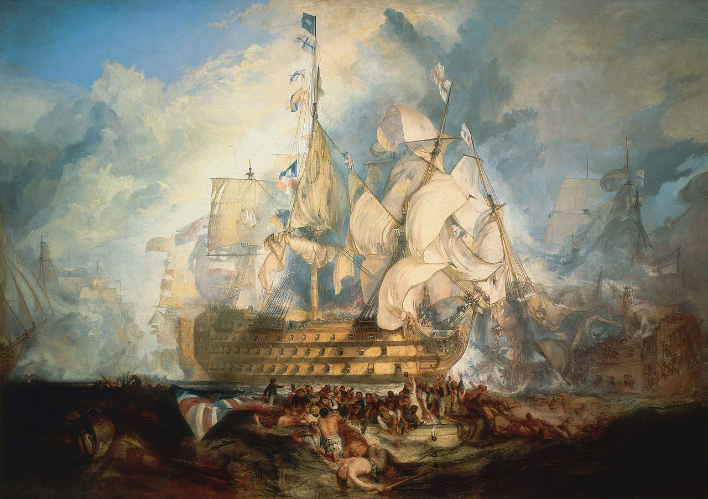

:icons: font
:revealjs_progress: true
:revealjs_previewLinks: true
:revealjs_mouseWheel: true
:revealjs_history: true
:revealjs_plugin_notes: disabled
// :revealjs_plugins: {slidesdir}/plugins.js
// :revealjs_plugins_configuration: {slidesdir}/configs.js
:customcss: custom.css
:source-highlighter: highlightjs

// Astuce : le premier slide n'est pas visible (à cause d'un bug dans asciidoctor-revealjs)
:notitle:
= Ceci n'est pas un bus de messages

== Ceci n'est pas un bus de messages

[NOTE.speaker]
--
Avant de parler de messages, on va faire un petit détour sur la mer.
Le bateau que vous avez sous les yeux est peut-être un clipper de la https://fr.wikipedia.org/wiki/Compagnie_britannique_des_Indes_orientales[compagnie britannique des indes orientales].
Cette compagnie envoie des bateaux dans les indes orientales acheter ... du thé.
Comment fait-on pour communiquer depuis Londres avec l'Inde ou la Chine ?
--

[%notitle]
=== Comment ne pas communiquer ?

[NOTE.speaker]
--
Sur cette toile de Turner, on voit comment un bateaud e ligne communique au XVIIIème siècle.
En l'occurence, ici, durant la https://en.wikipedia.org/wiki/The_Battle_of_Trafalgar_(painting)[bataille de Trafalgar].

Chaque pavillon sur le bateau correspond à une lettre de l'alphabet, 
et le message est donc une suite de pavillons dans le bon ordre.

Ca marche bien pour une communication à peu près immédiate 
(parce qu'il faut le temps d'attacher les pavillons et de les hisser). Mais c'est vite limité :

* le récepteur doit être en état de répondre au message 
(par exemple, il ne doit pas couler, ce qui peut arriver pendant une bataille navale)
* Le récepteur doit être à portée de vue de l'émetteur (autrement dit connecté).
* Le récepteur doit comprendre le code utilisé.

Et ça, c'est ce qu'on fait quand on utilise un protocole connecté, comme le HTTP ...
--

[%notitle]
=== Comment communiquer ?

[NOTE.speaker]
--
Donc, comment communiquer ?
Tout simplement en confiant au capitaine du navire le courier à destination de l'établissement distant.

Ca marche assez bien, à quelques limites près

* Si le bateau coule, le message est perdu
* Si le destinataire n'existe plus, le message est inutile
* Le délai de transmission est important (mais le monde est lent)
* Si un autre bateau arrive avec un message prétendu bon, que faire ?
--

[%notitle]
== Qui sommes-nous ?

[cols="a,a"]
|===

| Nicolas Delsaux

@riduidel sur https://twitter.com/riduidel[icon:twitter[]] / https://github.com/riduidel[icon:github[]] / https://stackexchange.com/users/8620[icon:stack-overflow[]]

Développeur Java depuis l'an 2000

| Alexandre Fruchaud

https://twitter.com/MalcMacphail[icon:twitter[] @MalcMacphail] / https://github.com/mmacphail[icon:github[] mmacphail]

|===

image::images/zenika.png[height=100]

== Instant uchronie

[NOTE.speaker]
--
Et si la compagnie des indes existait aujourd'hui, comment communiquerait-elle avec les producteurs de thé ?
C'est ce qu'on va essayer de voir maintenant en essayant d'utiliser des méthodes modernes.

Et ça va nous permettre de mettre en évidence les types de message :

* document
* événement
* commande
--

[transition=none]
=== Commander du thé

[plantuml, {plantumldir}command, svg, opts="interactive"]
----
agent London
queue Message
agent "Sri-Lanka" as Ceylan
agent India
agent China
London -> Message:Je veux 1000 tonnes de thé
Ceylan-[hidden]-China
China-[hidden]-India
Ceylan<--Message
Message->China
Message-->India
----

[NOTE.speaker]
--
D'abord, la compagnie des Indes demande à ses sous-traitants par le biais d'une *commande* ses 1000 tonnes de thé.
--

[transition=none]
=== Fournir du thé

[plantuml, {plantumldir}event, svg, opts="interactive"]
----
agent London
queue Message
agent "Sri-Lanka" as Ceylan
agent India
agent China
London <- Message
Ceylan-[hidden]-China
China-[hidden]-India
Ceylan-->Message:J'ai 200 tonnes
Message<-China:J'ai 700 tonnes
Message<--India:J'ai 400 tonnes
----

[NOTE.speaker]
--
Au moment de la récolte, les différents fournisseurs déclarent les quantités produites.
Et doivent tous les envoyer au fournisseur, on a donc un seul destinataire.
--

[transition=none]
=== Acheter du thé

[plantuml, {plantumldir}document, svg, opts="interactive"]
----
agent London
queue Message
agent "Sri-Lanka" as Ceylan
agent India
agent China
London -> Message
Ceylan-[hidden]-China
China-[hidden]-India
Ceylan<--Message:Contrat pour 100 tonnes
Message->China:Contrat pour 600 tonnes
Message-->India:Contrat pour 300 tonnes
----

[NOTE.speaker]
--
Enfin, la compagnie envoie le contrat à chaque fournisseur, c'est un document.
--

== Merci !

image::https://media.giphy.com/media/1sMH6m5alWauk/giphy.gif[width=200%]
